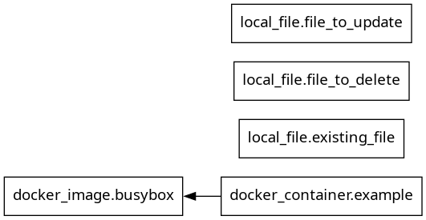
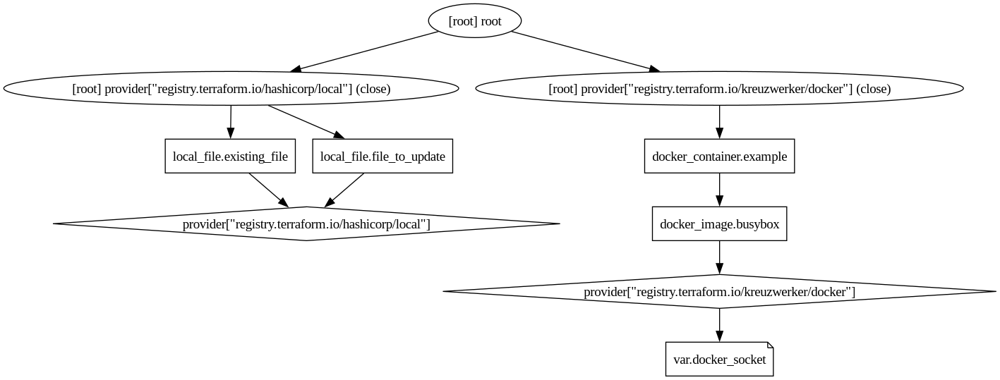
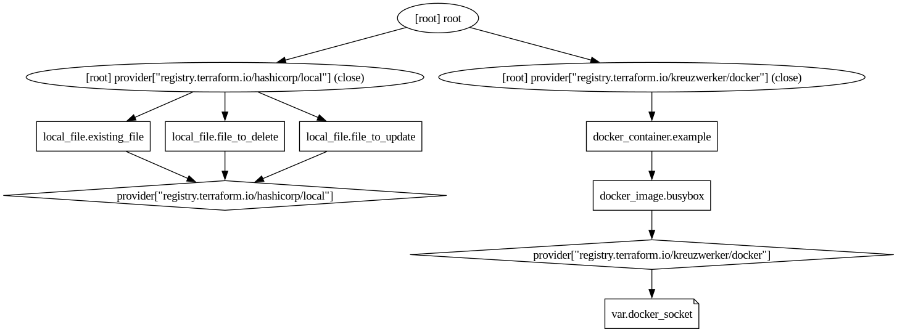
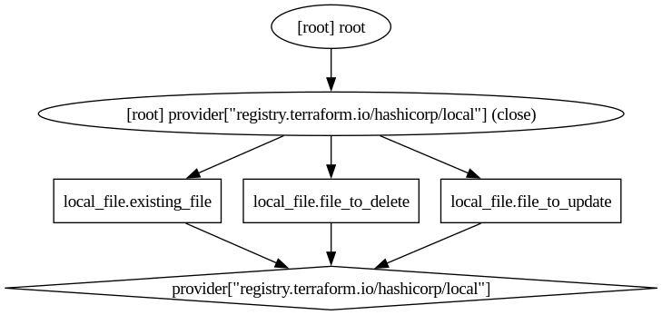
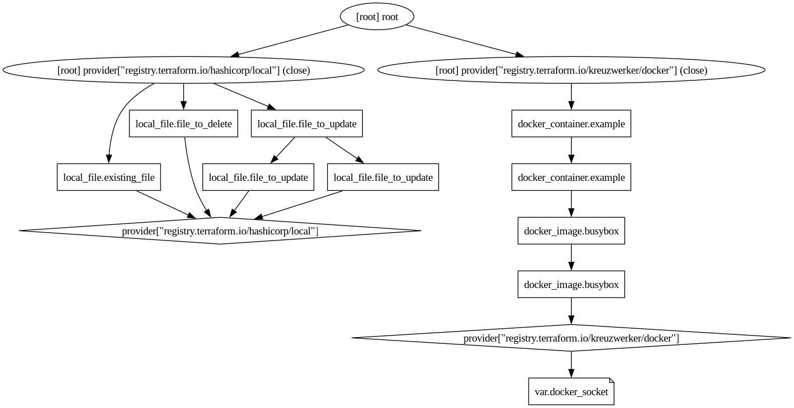

This directory is a snapshot of `terraform graph` output for various contexts:

Below `tf` is an alias for `terraform`

| test case description    | commands                                                            | image                                     |
|--------------------------|---------------------------------------------------------------------|-------------------------------------------|
| type = none              | `tf graph`                                                          |                  |
| type = plan              | `tf graph -type=plan`                                               |    |
| type = plan-refresh-only | `tf graph -type=plan-refresh-only`                                  |  |
| type = plan-destroy      | `tf graph -type=plan-destroy`                                       |            |
| type = apply             | `tf plan -out=test_plan.tf;` <br> `tf graph -plan=test_plan.tfplan` |                    |

Inspection of dot files for some test cases shows there is information present in the dot file which is not shown in the graph images.
This is probably most relevant for the apply test case.

JSON version of plan available at [tf_plan](./tf_plan.json).
Human-readable plan:

```
Terraform used the selected providers to generate the following execution plan. Resource actions are indicated with the following symbols:
  + create
  - destroy
-/+ destroy and then create replacement

Terraform will perform the following actions:

  # docker_container.example will be created
  + resource "docker_container" "example" {
      + attach                                      = false
      + bridge                                      = (known after apply)
      + command                                     = [
          + "echo",
          + "Hello, Docker!",
        ]
      + container_logs                              = (known after apply)
      + container_read_refresh_timeout_milliseconds = 15000
      + entrypoint                                  = (known after apply)
      + env                                         = (known after apply)
      + exit_code                                   = (known after apply)
      + gateway                                     = (known after apply)
      + hostname                                    = (known after apply)
      + id                                          = (known after apply)
      + image                                       = (known after apply)
      + init                                        = (known after apply)
      + ip_address                                  = (known after apply)
      + ip_prefix_length                            = (known after apply)
      + ipc_mode                                    = (known after apply)
      + log_driver                                  = (known after apply)
      + logs                                        = false
      + must_run                                    = true
      + name                                        = "example-container"
      + network_data                                = (known after apply)
      + read_only                                   = false
      + remove_volumes                              = true
      + restart                                     = "no"
      + rm                                          = false
      + runtime                                     = (known after apply)
      + security_opts                               = (known after apply)
      + shm_size                                    = (known after apply)
      + start                                       = true
      + stdin_open                                  = false
      + stop_signal                                 = (known after apply)
      + stop_timeout                                = (known after apply)
      + tty                                         = false
      + wait                                        = false
      + wait_timeout                                = 60

      + healthcheck (known after apply)

      + labels (known after apply)
    }

  # docker_image.busybox will be created
  + resource "docker_image" "busybox" {
      + id          = (known after apply)
      + image_id    = (known after apply)
      + latest      = (known after apply)
      + name        = "busybox:latest"
      + output      = (known after apply)
      + repo_digest = (known after apply)
    }

  # local_file.file_to_delete will be destroyed
  # (because local_file.file_to_delete is not in configuration)
  - resource "local_file" "file_to_delete" {
      - content              = "This file expected to be deleted" -> null
      - content_base64sha256 = "gjDwD7dDVALnOYAwTOSFbfQSGcAsYx66uqeikyvs/L0=" -> null
      - content_base64sha512 = "u3nxnbuweWp1pL7N4rlwfsR9XbGuw8TIyJiS/xEKGFgwhK47Aq8+XmcpDhwty5L/2X+sllT7B1e89/zspdgD/g==" -> null
      - content_md5          = "4d96d2167aee2d4c0b19b1dfd7d880ea" -> null
      - content_sha1         = "5450909de90f8e72ce0403d11eb42c88fc46a0ea" -> null
      - content_sha256       = "8230f00fb7435402e73980304ce4856df41219c02c631ebabaa7a2932becfcbd" -> null
      - content_sha512       = "bb79f19dbbb0796a75a4becde2b9707ec47d5db1aec3c4c8c89892ff110a18583084ae3b02af3e5e67290e1c2dcb92ffd97fac9654fb0757bcf7fceca5d803fe" -> null
      - directory_permission = "0777" -> null
      - file_permission      = "0777" -> null
      - filename             = "./local_file/file_to_delete.txt" -> null
      - id                   = "5450909de90f8e72ce0403d11eb42c88fc46a0ea" -> null
    }

  # local_file.file_to_update must be replaced
-/+ resource "local_file" "file_to_update" {
      ~ content_base64sha256 = "fiXrcryxpXZ5EVaxlkJBsx+oGecu87nM4Suwe9g+HZ4=" -> (known after apply)
      ~ content_base64sha512 = "xv6xwJaLYKx0em6G2/TS0wdgK58G+N019Y8WCy3Sn0Qwe3AhtKiYgP9OfZrD3JzG+opQe0QQ91RJqRebkkzwlA==" -> (known after apply)
      ~ content_md5          = "9d3d9b6907186f48809f703dab8ee88d" -> (known after apply)
      ~ content_sha1         = "b1395c2559ee92e8cd9a5a9fa5dca27e4d87d8ea" -> (known after apply)
      ~ content_sha256       = "7e25eb72bcb1a576791156b1964241b31fa819e72ef3b9cce12bb07bd83e1d9e" -> (known after apply)
      ~ content_sha512       = "c6feb1c0968b60ac747a6e86dbf4d2d307602b9f06f8dd35f58f160b2dd29f44307b7021b4a89880ff4e7d9ac3dc9cc6fa8a507b4410f75449a9179b924cf094" -> (known after apply)
      ~ file_permission      = "0777" -> "0700" # forces replacement
      ~ id                   = "b1395c2559ee92e8cd9a5a9fa5dca27e4d87d8ea" -> (known after apply)
        # (3 unchanged attributes hidden)
    }

Plan: 3 to add, 0 to change, 2 to destroy.
```
